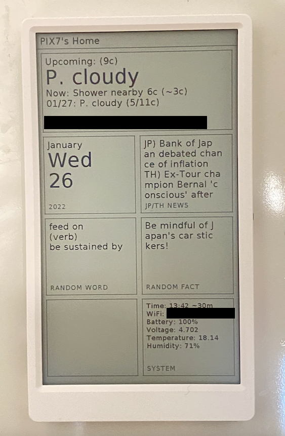

# M5Paper Micropython Data Text Display

## Introduction

I have been wanted an ambient display in my room for quite a while, but I don't want it to be just another LCD screen that I have to plug in at all times. Then I found this M5Paper thingy one day when I browsed a microcontroller store. So I bought it, played around with it, and this is like an experimental, yet usable project.

I'm not going to update this code / provide support because I'm moving to code using C so that I have more control over stuff.

## Design Rationale

I built this code so that I don't have to edit the on-device code much. The data collection and processing are done on the cloud. It just displayed whatever it received. Like in the image, it shows whatever it receives from the endpoint. I display information that I feel like I can read while I brew my coffee, or just take a walk to the kitchen, so the information here isn't really important or time-sensitive.

## Usage

1. Flash UiFlow into your M5Paper [follow this instruction](https://docs.m5stack.com/en/quick_start/m5core/uiflow)
2. Edit some variables in main.py, then upload the file to the device (either via UiFlow or USB mode + Micropython)
3. Implement an endpoint for the device to get data from (See next section)

## Endpoint Implementation

The endpoint is resting on my cloud server. It is one of the microservices on my server so that everything isn't tightly coupled.

First, I have a data aggregation service that fetches data from various sources, at different intervals based on the API limitation. Then I format those data to my liking.

Second, I implement the endpoint for this device, it gets the aggregated data from my database, format it into an appropriate object (see `example-endpoint-data.json`), and return the request when the device fetches.

Note that, you can see I send some device metrics to the endpoint too (Line 31), I logged these metrics on the cloud, but you can discard it.

### Endpoint Data Note

- `shutdownDelay` is the delay from the device finished fetching to it being shutdown again (seconds)
- `wakeupInterval` is the delay between fetching, during this period, the device sleep to conserve battery (seconds)
- `textN` and `firstLine` have around 14 characters limit (except menu0, around 28)
- `textLargeN` has around 6 characters limit (except menu0, around 13)
- `actionName` has around 17 characters limit (except menu0, around 37)
- `textLarge1` replaces `text1` and `text2`, similarly with `menuN.textLarge2` replaces `text3` and `text4`
- `actionName` is the last line, I originally intended to allow interaction on-device, but I felt like this ambient display shouldn't have interaction on itself, the name remains

## Further Reading

- [https://www.gwendesign.ch/kb/m5stack/m5paper/#light-sleep-deep-sleep-and-shutdown-current](https://www.gwendesign.ch/kb/m5stack/m5paper/#light-sleep-deep-sleep-and-shutdown-current)